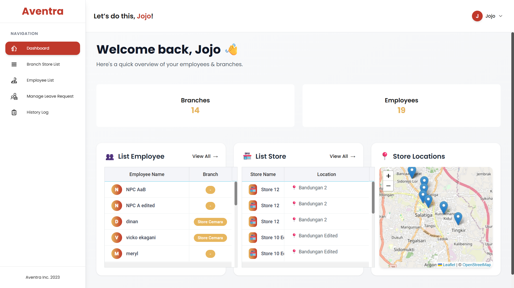
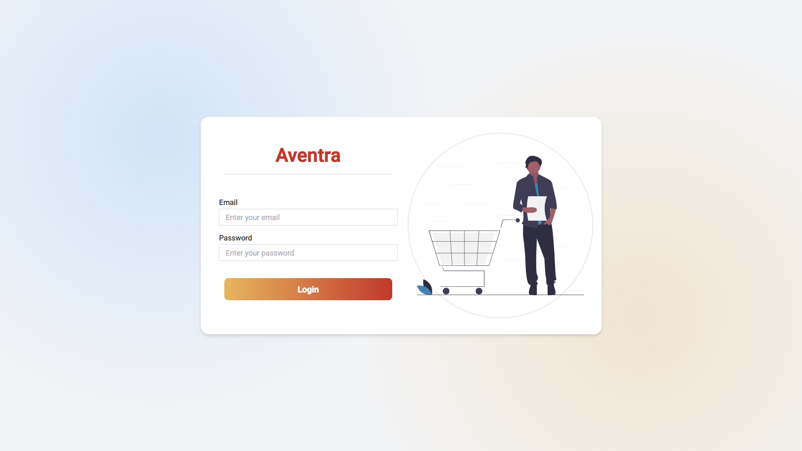
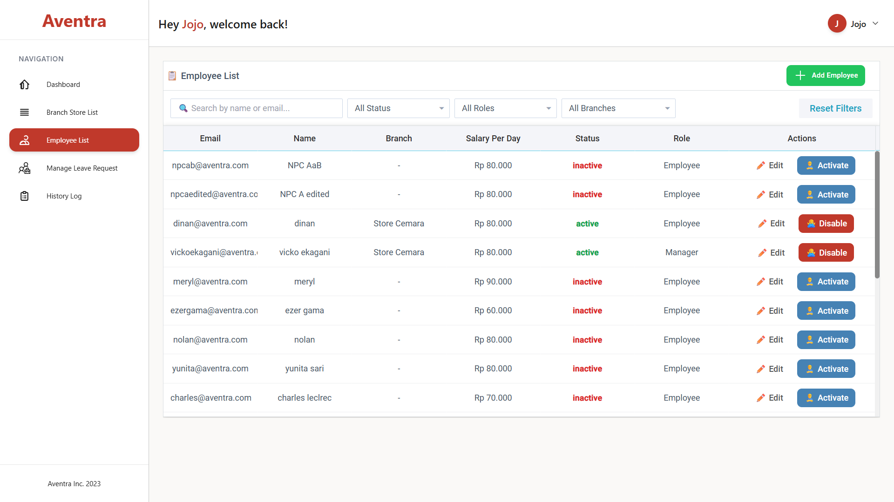

# Employee Management

<p align="center">
  <a href="./">
    
  </a>
</p>

<p>
  
</p>
<p>
  
</p>
<p align="center">
  <a href="https://github.com/josephsbtn/employee-management/actions/workflows/ci.yml"></a>
  
  
  
</p>

A lightweight, modular Flask-based Employee Management system with features for attendance tracking, leave/annual requests, employee profiles, history logs, and basic store/shift management. The codebase separates routes, services, and repositories and uses MongoDB for storage.

_Preview: owner dashboard and login screens_

<!-- toc -->

- [Key features](#key-features)
- [Quick start](#quick-start)
- [Configuration](#configuration)
- [Endpoints](#endpoints)
- [Testing](#testing)
- [Project layout](#project-layout)
- [Contributing & Support](#contributing--support)
- [Maintainers](#maintainers)
<!-- tocstop -->

## Key features

- Attendance recording and history
- Annual/leave request submission and attachment handling
- Employee profile management and JWT authentication
- Shift and branch management scaffolding
- Service/repository separation for easier testing

## Quick start

Prerequisites:

- Python 3.8+
- MongoDB (local or cloud)

Clone and install:

```powershell
git clone <repo-url>
cd employee-management
python -m venv .venv
.\.venv\Scripts\Activate.ps1
pip install --upgrade pip
pip install -r requirements.txt
```

Run (development):

```powershell
python main.py
# Visit http://127.0.0.1:5000
```

Run (production example):

```powershell
gunicorn main:app -w 4 -k eventlet --bind 0.0.0.0:8000
```

## Configuration

The project reads configuration from `utils/config.py`. For development, prefer a `.env` file and see `.env.example`:

```text
MONGO_URI=mongodb://localhost:27017
DATABASE=aventra_db
JWT_SECRET_KEY=change_this_to_a_secure_value
FLASK_ENV=development
PORT=5000
```

Do not commit secrets. Use environment variables or a secrets manager in production.

## Endpoints

- `/api/employees` — employee operations
- `/api/attendance` — attendance endpoints
- `/api/annualRequest` — annual/leave request endpoints
- `/auth` — authentication

Inspect the `routes/` folder for route implementations and example request payloads.

## Testing

Run tests locally:

```powershell
pytest -q
```

Local results (Dec 9, 2025): **55 passed, 0 failed** (service functional tests run locally).

There are additional functional tests and non-functional load scripts under `non-functional/`.

## Project layout

- `main.py` — Flask app entrypoint
- `routes/` — Blueprints / controllers
- `service/` — business logic
- `repo/` — persistence layer (MongoDB)
- `templates/`, `static/` — UI and assets
- `utils/` — helpers, `mongoConnect.py`, `config.py`
- `tests/` — unit and functional tests

## Contributing & Support

Found a bug or want a feature? Open an issue. See `CONTRIBUTING.md` for contribution guidelines.

Suggested next steps:

- Add `CODE_OF_CONDUCT.md` and expand `CONTRIBUTING.md`.
- Replace placeholder badges with CI/coverage badges after integrating CI.
- Move secrets out of `utils/config.py` into environment variables.

## Maintainers

- Repository owner: `josephsbtn`

---

If you'd like, I can also add a `TESTS.md` with commands for running specific test groups, or update the CI workflow to start a MongoDB service for CI.
